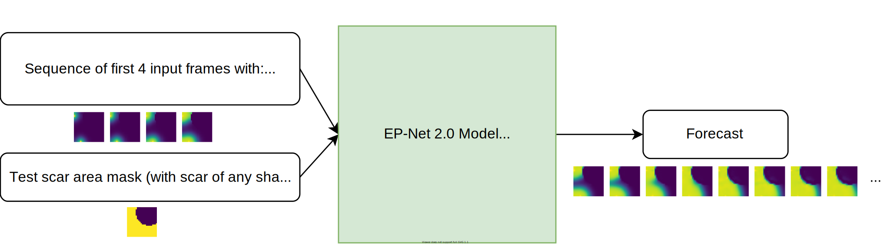

# EP-Net 2.0: Out-of-Domain Generalisation for Deep Learning Models of Cardiac Electrophysiology (Test code for trained model)

Test code associated with an [article presented at the conference FIMH 2021](.) by Victoriya Kashtanova, Ibrahim Ayed, Nicolas Cedilnik,
Patrick Gallinari and Maxime Sermesant.



Your can test our model via this Binder virtual environment [](https://mybinder.org/v2/gh/KVict-new/EP-Net-2.0/HEAD?filepath=Test.ipynb) or on your personal computer via Jupyter notebook file [`Test.ipynb`](./Test.ipynb) after installing the following requirements.

Requirements
------

To run the code within this repository requires [Python 3.7+](https://www.python.org/) with the following dependencies

- [`torch`](https://pytorch.org/get-started/locally/)
- and some standard python libraries [`matplotlib`](https://matplotlib.org/stable/users/installing.html),  [`numpy`](https://numpy.org/)

which can be installed via
```
$ pip install -r requirements.txt
```

Our Results
------

### Scar of Rectangular Shape


### Multiple Onsets


### Scars of Various Shapes


### Limitations : Thin Scars (thickness less than 2 pixels)

