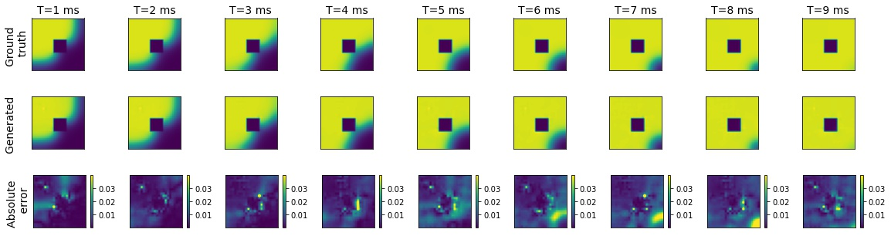
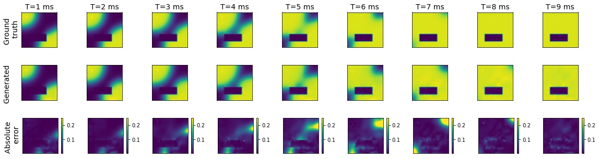
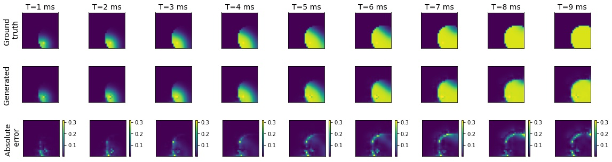
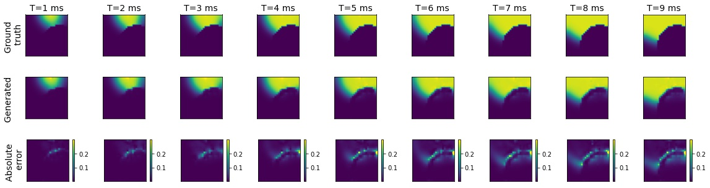
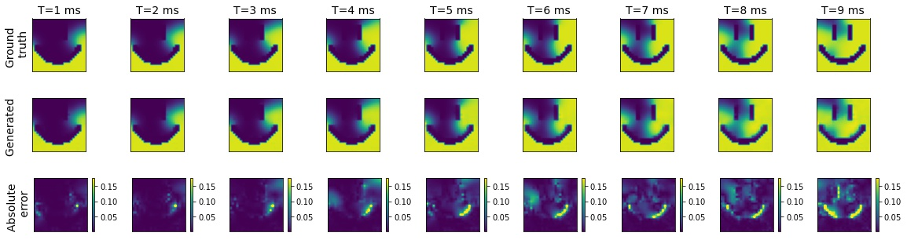
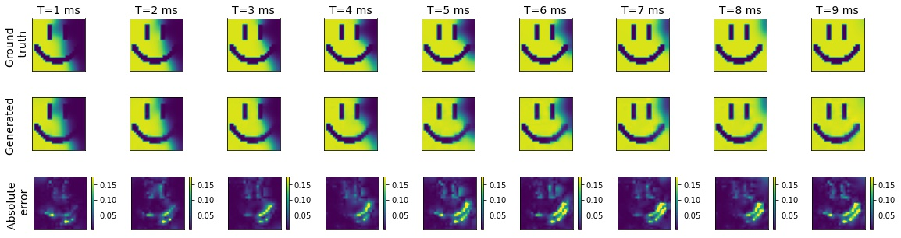
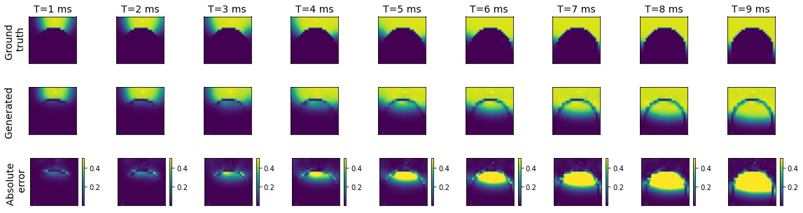

# EP-Net-2.0
Test of trained PDE-Net 2.0

## Our Results

### Scar of Rectangular Shape

### Multiple Onsets

### Scars of Various Shapes

## Limitations : Thin Scars (thickness less than 2 pixels)

